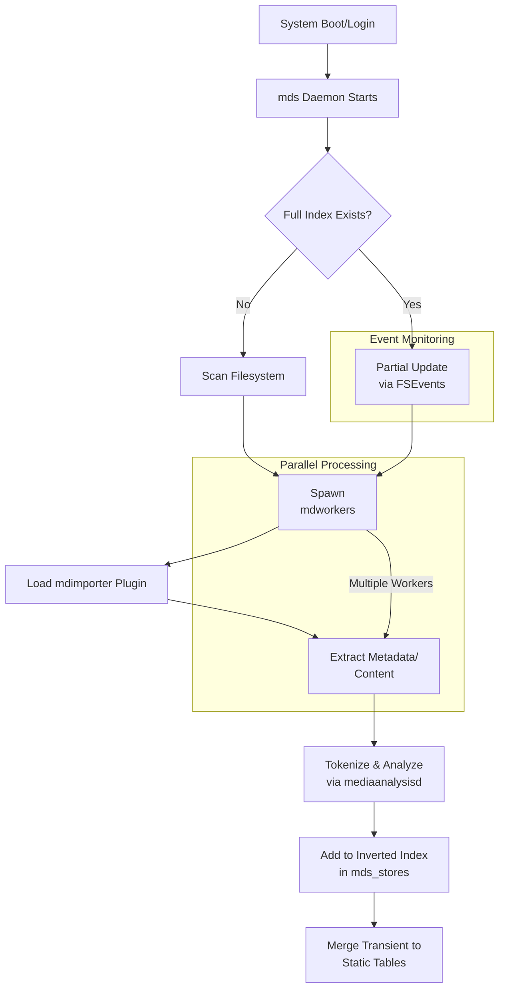
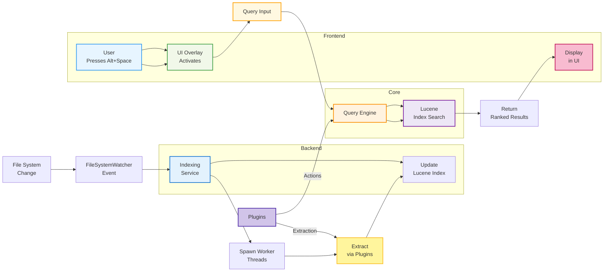

# FlashSpot: A Windows Equivalent to macOS Spotlight

## Executive Summary

FlashSpot is designed as a high-performance, on-device search and launcher tool for Windows, inspired directly by macOS Spotlight. It aims to provide near-instantaneous access to files, applications, system content, calculations, conversions, and actionable workflows through a sleek overlay interface activated by Alt+Space. By leveraging an inverted index for efficient querying and event-driven indexing, FlashSpot mirrors Spotlight's architecture while adapting to Windows-specific APIs and ecosystems. This artifact serves as a comprehensive architecture document, blending Spotlight's proven technical foundations with our detailed implementation plan. It includes narrative explanations, carefully crafted Mermaid diagrams for visual representation, and a TODO list for development milestones.

The core philosophy is privacy-first (all processing on-device), extensibility via plugins, and minimal resource footprint. Unlike existing Windows tools like PowerToys Run or Everything, FlashSpot incorporates full-text content indexing, semantic actions (e.g., setting timers or sending emails), and integrations with Windows features like Cortana APIs for suggestions

## Spotlight's Architecture: A Deep Dive

To build FlashSpot effectively, we must first internalize Spotlight's architecture, which has evolved since macOS Tiger (2005) into a robust, daemon-driven system. Spotlight operates as a metadata-driven search engine, emphasizing speed through pre-indexing and real-time updates. Its design is modular, with separation of concerns between indexing, storage, querying, and user interaction.

### Core Components and Processes

Spotlight's backbone is the **Metadata Server (mds)**, a system daemon that orchestrates indexing across the macOS filesystem. Upon system boot or login, mds initiates a full or partial index build. For partial updates, it relies on the **File System Events (FSEvents)** kernel mechanism, which logs changes (creations, modifications, deletions) in a persistent database at `/.fseventsd`. This event-driven approach ensures low-latency updates: when a file changes, mds detects it within milliseconds and spawns **mdworker** processes—sandboxed workers that extract metadata and content in parallel.

Each mdworker identifies the file's Uniform Type Identifier (UTI) and loads an appropriate **mdimporter** plugin (e.g., for PDFs or images). These plugins extract attributes like creation dates, tags, EXIF data, and full-text content. Text is tokenized (split into words, stemmed, and stop words removed), and advanced analysis occurs via **mediaanalysisd**, which handles embeddings for semantic search or OCR on images. The extracted data feeds into **mds_stores**, which manages the index storage.

### Index Structure and Storage

The index is stored in a hidden directory per volume (e.g., `/.Spotlight-V100/Store-V2`), using a proprietary database format optimized for compression and speed. At its heart is an **inverted index**, as detailed in Apple's patents (e.g., US 7,783,589): a dictionary maps tokens (words or phrases) to postings lists (document IDs, positions, and frequencies). This enables rapid lookups using algorithms like TF-IDF for relevance ranking. The index is tiered—transient tables for recent changes merge into static ones during idle times to optimize for both updates and searches. Collocation indexes track phrase proximity (e.g., treating "New York" as a unit), and separate stores handle metadata vs. full content.

Spotlight supports exclusions via a `VolumeConfiguration.plist` file, and indexes are encrypted per-user for privacy. Developers extend it through the **CoreSpotlight Framework**, allowing apps to donate searchable items via `CSSearchableItem` objects, which include attributes like keywords and thumbnails.

### Query and UI Layer

Queries are handled by the **NSMetadataQuery** API, supporting predicates (e.g., `kMDItemTextContent CONTAINS 'query'`) and natural language. Results are ranked by relevance, recency, and user history, with categories like "Top Hit" or "Applications." The UI is a Cocoa-based overlay window (activated by Cmd+Space), featuring a search bar with live results, previews via Quick Look, and actions (e.g., Cmd+Enter to open). In recent macOS versions like Tahoe, it integrates Siri for web suggestions and actions like creating reminders.

Performance is key: initial indexing can take minutes for large drives but uses throttling to avoid CPU spikes. Bugs in past versions (e.g., excessive SSD writes) highlight the need for robust housekeeping.

### Mermaid Diagram: Spotlight Indexing Flow

*The above diagram clearly visualizes the parallelism, event-driven updates, and the modular flow from system start through metadata extraction and indexing.*

---

## FlashSpot's Architecture: Adaptation and Enhancements

Building on Spotlight's model, FlashSpot adapts to Windows by using native APIs like FileSystemWatcher for events and Lucene.NET for indexing. We'll create a modular system with a background service for indexing, a query engine for searches, and a WinUI-based overlay for interaction. Enhancements include deeper Windows integrations (e.g., indexing Edge bookmarks or Outlook emails) and optional ML for semantic queries.

### High-Level System Design

FlashSpot consists of three primary layers:  
- **Backend (Indexing and Storage)**  
- **Core (Query and Actions)**  
- **Frontend (UI and Activation)**  

The backend runs as a Windows Service for persistence, ensuring indexing starts on boot and responds to file changes. The core layer processes queries using an inverted index, while the frontend provides a visually appealing interface.

Privacy is enforced: all data stays local, with user-configurable exclusions. Extensibility comes via a plugin system, similar to mdimporters, allowing third-party developers to add extractors for custom file types (e.g., CAD files).

### Detailed Component Breakdown

#### 1. Indexing Service

Modeled after mds, this is a .NET-hosted Windows Service (using `Microsoft.Extensions.Hosting.BackgroundService`). On system start (via Task Scheduler or Service Control Manager), it checks for an existing index in `%AppData%\FlashSpot\Index`. If absent, it performs a full scan of user directories (Documents, Desktop, Downloads) and drives using `Directory.EnumerateFiles("*", SearchOption.AllDirectories)`, excluding system paths like `C:\Windows` by default.

For real-time updates, it employs `FileSystemWatcher` on monitored paths, triggering events for Created, Changed, Deleted, and Renamed. Events queue files in a `ConcurrentQueue<T>`, processed by worker threads (pool size based on `Environment.ProcessorCount`). Each worker:
- Determines file type via extension or MIME (using `System.Net.Mime`).
- Loads a plugin (implementing `IContentExtractor` interface) to pull metadata (e.g., `FileInfo` for dates/size) and content (e.g., text from PDFs using PdfSharp).
- Tokenizes text: splits on whitespace/punctuation, applies stemming (PorterStemmer from Lucene.NET), and removes stop words.
- Adds to the index using Lucene.NET's `IndexWriter`, with fields like "path", "filename", "content", "metadata".

The index uses Lucene's Directory (RAMDirectory for transients, FSDirectory for persistence), with tiered merging to handle updates efficiently. Housekeeping runs on a timer (every 15 minutes) to optimize and compact the index, purging stale entries.

#### 2. Query Engine

Inspired by NSMetadataQuery, this uses Lucene.NET's `IndexSearcher` for queries. Input from the UI is parsed into Lucene queries (e.g., supporting Boolean operators, phrases, filters like "kind:pdf" via custom analyzers). Results are ranked using BM25 similarity, boosted by recency (via `DateTime` fields) and user preferences (e.g., frequent apps).

Integrations extend beyond search:
- **Applications**: Scan registry (`HKLM\SOFTWARE\Microsoft\Windows\CurrentVersion\Uninstall`) and Start Menu for launchable items.
- **Calculations/Conversions**: Parse expressions with `MathParser.NET` or `DataTable.Compute`; handle units via a custom library (e.g., mapping "km to miles").
- **Actions**: Plugin-based, e.g., "set timer 5min" spawns a `System.Timers.Timer`; "send email" uses `SmtpClient` or Outlook interop.
- **System Content**: Index contacts via `Microsoft.Office.Interop.Outlook` (if available), or fall back to file-based (e.g., .vcf exports).
- **Web Suggestions**: Optional, using `HttpClient` for APIs like OpenWeather for weather, but toggled off by default for privacy.

Semantic enhancements could use ML.NET for embeddings, training on user queries to improve natural language handling.

#### 3. UI and Activation Layer

The UI is a WinUI 3 application (`Microsoft.UI.Xaml.Window`), borderless and centered, with Acrylic blur for a "Liquid Glass" aesthetic like modern macOS. Activated globally via `RegisterHotKey` (P/Invoke to user32.dll) for Alt+Space.

The search bar uses `TextBox` with live querying (throttled to 100ms debounce). Results display in a `ListView` grouped by category (Apps, Files, Suggestions), with previews (e.g., `WebView2` for file thumbnails). Actions appear on hover/right-click, and quick keys (e.g., Alt+1) filter views.

#### 4. Plugin System and Configuration

Plugins are .NET assemblies loaded dynamically from `%AppData%\FlashSpot\Plugins`, implementing interfaces like `IExtractor` or `IActionProvider`. Configuration is stored in a JSON file (`settings.json`), editable via a tray icon app, including path exclusions and feature toggles.

### Mermaid Diagram: FlashSpot Component Interaction

*This improved, color-coded diagram visually distinguishes core system flows and plugin interactions, making modularity and sequencing explicit.*

---

### Performance and Security Considerations

Target <1s query times for 1TB datasets by optimizing Lucene configs (e.g., commit intervals). Throttle indexing during high load using `PerformanceCounter`. Security: Encrypt index with DPAPI; sandbox workers via AppDomains. Handle edge cases like network drives or encrypted folders gracefully.

## Development Plan and Roadmap

Our plan is iterative: start with core indexing and search, then add UI and features. Use Agile with 2-week sprints, testing on Windows 10/11.

### Phase 1: Foundation (Weeks 1-2)
- Set up .NET project structure: Service, Core DLL, UI App.
- Implement basic Lucene indexing for files.

### Phase 2: Real-Time and Queries (Weeks 3-4)
- Add FileSystemWatcher and worker parallelism.
- Build query parser and basic ranking.

### Phase 3: UI and Integrations (Weeks 5-6)
- Develop WinUI overlay with hotkey.
- Integrate calculations, actions, and plugins.

### Phase 4: Polish and Testing (Weeks 7-8)
- Add configurations, privacy features.
- Performance benchmarking and bug fixes.

## TODO List

- [ ] Research Lucene.NET best practices for Windows file indexing (browse docs via tool if needed).
- [ ] Prototype FileSystemWatcher handling for large directories to avoid event floods.
- [ ] Design IPlugin interface and create sample extractors (PDF, Image).
- [ ] Implement encryption for index storage using ProtectedData.
- [ ] Create unit tests for query parsing (e.g., Boolean support).
- [ ] Benchmark initial indexing time on a 100GB dataset.
- [ ] Integrate ML.NET for optional semantic search.
- [ ] User testing: Gather feedback on UI responsiveness.
- [ ] Documentation: Expand this artifact with code snippets.
- [ ] Deployment: Package as MSI installer with service registration.

This artifact provides a blueprint for FlashSpot, ensuring fidelity to Spotlight while innovating for Windows. Next steps: Begin coding Phase 1.